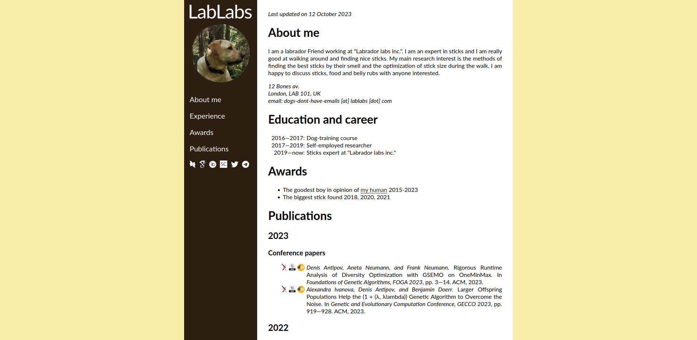

# Personal page generator for scientists

This is a simple generator of a personal page, which is optimized for the people working in academia. To generate a personal web-page with it, you should follow the following steps:

1. Adjust a design
    - Change the color scheme
    - Change the logo of your university or company and your photo
    - \[Optional\] Change the font
2. Prepare the content
    - Write the content of the page into the `content.md` file (the format of this file is described below)
    - \[Optional\] Prepare a bibliography file to be added to your webpage
3. Run the generator script
    - Prepare the dependencies (Python 3 and several packages for it)
    - If you chose to add the list of publications, this script will try to add a link to arXiv to your conference or journal papers, but sometimes it needs some assistance from you
4. Put the generated `index.html` file together with `styles.css` and the folders `fonts` and `images` to your server
 
## Features

- This generator is easy to adjust for your institute's design
- The website is adjusted to also look well on mobile devices
- Smart generation of the list of publications, which puts the links to the corresponding arxiv papers to your conference/journal publications
- The list of publications can be taken either from a `*.bib` file or directly form your DBLP page 
- A bibtex button allows to get a bibitem (makes citing you easier)

Mobile view (with open and closed menu): 

&#160;&#160;
 

Wide screen view:

 

Half-screen view (no margin to the left from the menu):

 
