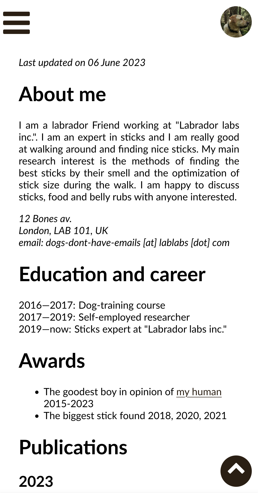

# Personal page generator for scientists

This is a simple generator of a personal page, which is optimized for the people working in academia. To generate a personal web-page with it, you should follow the following steps (the more detailed instructions can be found below):

1. Adjust a design
    - Change the color scheme
    - Change the logo of your university or company and your photo
    - \[Optional\] Change the font
2. Prepare the content
    - Write the content of the page into the `content.md` file (the format of this file is described below)
    - \[Optional\] Prepare a bibliography file to be added to your webpage
3. Run the generator script
    - Prepare the dependencies (Python 3 and several packages for it)
    - If you chose to add the list of publications, this script will try to add a link to arXiv to your conference or journal papers, but sometimes it needs some assistance from you
4. Put the generated `index.html` file together with `styles.css` and the folders `fonts` and `images` to your server
 
## Example pages

You do not need to give any credit to me for using this generator, but if you do, I would appreciate if you send me the link to your page to add it to this list of examples.

[Denis Antipov](https://ctlab.itmo.ru/~dantipov/)

## Features

- This generator is easy to adjust for your institute's design
- The website is adjusted to also look well on mobile devices
- Smart generation of the list of publications, which puts the links to the corresponding arxiv papers to your conference/journal publications
- The list of publications can be taken either from a `*.bib` file or directly form your DBLP page 
- A bibtex button allows to get a bibitem (makes citing you easier)

Mobile view (with open and closed menu): 

&#160;&#160;
 

Wide screen view:

 

Half-screen view (no margin to the left from the menu):

 

# Adjusting the design

First download the project via tortoise git or via the commant line:

    `git clone https://github.com/AntipovDen/Personal-page-generator.git`

## Color scheme

Most universities and companies have their own corporate style, which includes the preferable color scheme. You should choose the colors for your webpage from such a palette. The page color scheme includes:

1. Sidebar color *(suggestion: choose the darkest color for this)*
2. Sidebar text color *(suggestion: choose white color or the whitest color from palette)*
3. Margin color *(suggestion: choose some kind of light color, or you can choose a sidebar color and add some opacity to it)*
4. Content background color *(suggestion: choose white)*
5. Background color for buttons when you hover over them *(suggestion: choose something brighter than the background, but text in sidebar-text-color must look well on it)
6. [Optional] The color for the links on the page *(suggestion: choose the sidebar color for the visited links and the background color for buttons for the unvisited links)*

The screenshot below explains the colors in the webpage:

 

To setup corresponding colors yoy should edit `styles.css` file. The comments in that file indicate, where you should change the colors. Note that all necessary colors are set up in the beginning of the file, in the first 51 lines.

### Changing the logo and your photo

Upload your university or company logo to the the `images` folder and rename it to `UniLogo.png` or put the actual name of the file to the corresponding part of line 16 of `template.html`. Suggestion: most universities have logos of different styles, and usually they have a horizontal one, which has a width to height ratio approximately 5:1. This is the best logo for this webpage. Also update the link to your university's website in line 16 of `template.html` in `href` field. 

Upload your favorite photo of yourself to the `images` folder and rename it to `me.jpg` or put the actual name of the file to the corresponding part of line 20 of `template.html`. Please, crop our photo as a perfect square, otherwise it will appear not in a circle, but in an ellipse.

Upload the desired favicon (the icon shown in the browser's tab title) to the `images` folder and rename it to `favicon.png` or put the actual name of the file to the corresponding part of line 10 of `template.html`. This should be a low-quality picture, since it will be compressed to only 32x32 pixels in most browsers.

## [Optional] Changing the font

Some universities also have their own font. If you want to use it in your web-page, you should change the font name in line 3 of `styles.css`. The default Lato font is supposed to look nice for most people, but you never can satisfy everyone. Some of the fonts are not supported by some operating system by default, so Lato is the safest option. Otherwise you might want to google the right way to use your font in html. Often for this you just need to add a link to the font files into the `<head>` of your `html` file.

# Preparing the content

To prepare the content you should edit `content.md` file. This file uses a markdown syntax, but with some differences and some necessary moments in the structure.

1. The first line of `content.md` should contain your name (it will be displayed in the tab name in the viewer's browser)
2. The next lines are the links to your pages at social media, which are displayed in the sidebar (in the same order as you mention them in `content.md`). The supported links are: DBLP, Google Scholar, ORCID, ResearchGate, Scopus, LinkedIn, Telegram, Facebook, Twitter and Instagram.
3. After that `content.md` contains the actual content of the page, which is divided into sections.
    - Each section starts with its name, which is a line starting with a `#` symbol. Each section has its own link in the sidebar menu. By default, you will see in the sidebar tha actual name of the section, but if you want to shorten it, you can add a short name for it after another `#` symbol in the same line, like this:     
    
        `# The name of the section # Short name`
    - Then you add the content of the section, which can be a paragraph, a list or a list with specific items
    - To add a paragraph you just write a paragraph in the `content.md`. Example of the section consisting of two paragraphs is the "About me" section in the screenshots above. In paragraphs you can use some html-specific symbols, if you want, e.g., you can add a paragraph with address like this:
        
        `<address> Street address   City, Zip code   email: generic-email [at] gmail [dot] com </address>`
    
        You also can  add links in Markdown format, like this:
        
        `[click me to get to google](https://google.com)`
    - To add a list you just add a bunch of lines, each of which starts with `-`. An example of a section with a list is the "Awards" section on the screenshots above. you also can use HTML or Markdown features in the lists.
    - The lists with specified items are mostly used for the lists with dates (e.g., working experience or education). The example is the "Education and career section" in the screenshots above. To make such a list, you should start each line with `*` symbol and use the column `:` to separate the dates from the item content. 
    - If you name some section "Publications", then the generator can fill it with the list of you publication (see instructions on it below). You can also add some content here, it will be added after the list of publications.

## [Optional] Preparing the bibliography

If you want to have a list of publications, you have two options:
1. Take the list of publications from your page at DBLP (then you do not need to do anything at this step)
2. Prepare a `.bib` file, containing all your publications.

The main reasons to prepare your `.bib` file is that you accepted but not published papers are not shown at DBLP. Also, you might find the DBLP format of conference names clumsy, e.g., you do not want to include the dates and the hosting city, so you can edit your bib file as you want. 

# Run the generator

## Download the software

To run the generator, you will need Python3 and the following packages:
- `bibtexparser` -- to parse the `.bib` file
- `pylatexenc` -- to properly format the titles from the bib file
- `markdown` -- to work with non-latin characters in your content
- `Levenshtein` -- to ease finding the matching conference or journal papers for your arXiv papers by their titles

You can download Python from the official web-site. To install the packages you can use the python package manager by running the following command for each package:

    pip3 install [package_name]

If you are using Linux, you can use your favorite package manager to install these packages. I do not think that you need additional details here.

## Run the script

To run the script you should open the command line in the folder with `html-generator.py` and run the command:

    python3 html-generator.py

In this case the generator will try to find file named `bibliography.bib` in the current folder and use it as a list of your publications, but if there is no such file, it will not generate anything in the Publications section of your page. If you want to specify the link to your DBLP page, you should add `-il link-to-your-dblp` argument, e.g.,

    python3 html-generator.py -il https://dblp.org/pid/160/0973.html

If you want to specify some `.bib` file different from `bibliography.bib`, you can use `-if` argument:

    python3 html-generator.py -if "relative/path/to/your/publications.bib"
    
Independently of the above arguments you can add `-c` so that your bibliography had shorter conference and journal names (e.g., without the dates and the hosting city). This is hard to understand, how the names should be transformed, so to get a satisfying result, you should edit the part or `publications.py` file (lines 60-86) to use this feature for your personal needs. Example of the command to use this feature together with a link to DBLP:

    python3 html-generator.py -il https://dblp.org/pid/160/0973.html -c

or

    python3 html-generator.py -c -il https://dblp.org/pid/160/0973.html

The order if arguments does not play any role.

## While running the script

The generator will automatically match your arXiv papers with your conference and journal papers with the same name. However, sometimes papers are published at arXiv with different names, sometimes they do not have a reviewed version or probably DBLP messed up the LaTeX-style names of your papers, so the name of arXiv paper and its reviewed version are too different (if they have a Levenshtein distance at most 9, then the generator will match them). When the generator cannot find a matching paper, it will ask you what to do, proposing you to 

- Choose one of the papers with the same set of authors
- Enter the paper ID manually
- Mention this paper in the publications list as an arXiv paper (the matched papers are not mentioned separately)
- Do not mention this paper at all

This will look like this in the command line:
 
    `Did not find a matching title for 1904.06981 (year 2019), titled "The Efficiency Threshold for the Offspring Population Size of the ({\(\mu\)}, {\(\lambda\)}) {EA}"
    Select possible option:
    (0) AntipovDY19: "The efficiency threshold for the offspring population size of the (\emph{{\(\mathrm{\mu}\)}, {\(\lambda\)}}) {EA}"
    (1) Enter ID manually
    (2) Count this paper as a journal paper
    (3) Do not mention this paper`

To choose one of the options you should enter the number of this option and press 'enter'. If you choose to enter the ID manually, the generator will propose you to enter it (if you know it). All IDs are not DBLP ids, but they are merged: from the following parts:
 
1. The first authors last name
2. The first letters of the last names of all other authors
3. The last two digits of the year it was published
4. If there are two identical IDs, then the name of the journal or conference is added.

After the script finishes its work, you can view the resulting file `index.html` in your favorite browser and fix the mistakes you made in the previous steps. Note that to fixe the style mistakes you do not have to re-run the script, just edit `style.css` file.

# Upload your web-page to your server

Upload the following files and folders to the server on which you are going to host your web page:

- `index.html`
- `styles.css`
- `images` folder
- `fonts` folder
